# Herd Immunity Visualised

Modern Day Vaccination programs have led to the decrease and total eradication of harmful and potentially life-threatening diseases such as smallpox, measles, and polio. These diseases are often highly contagious, spreading across populations leaving a significant amount of damage in their path. Vaccines' effectiveness relies on the concept of ‘Herd Immunity', where having the vast majority of the population vaccinated protects those that can't receive vaccinations due to compromised immune systems. An increase in people opting not to have vaccinations can put this herd immunity at risk, increasing the risk of an epidemic within a population.

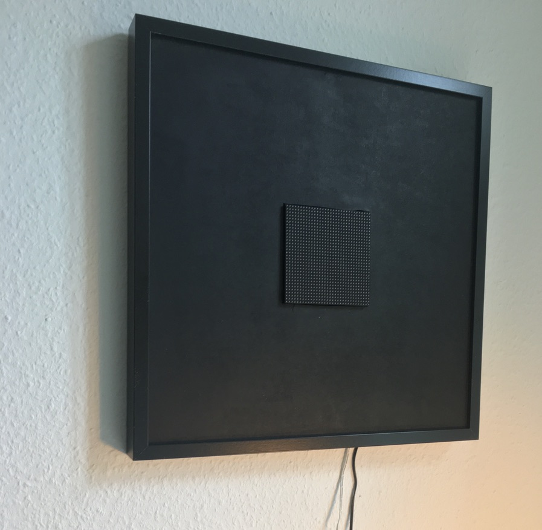
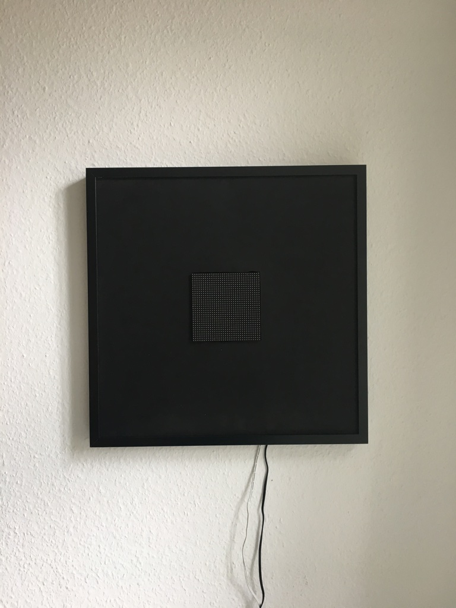
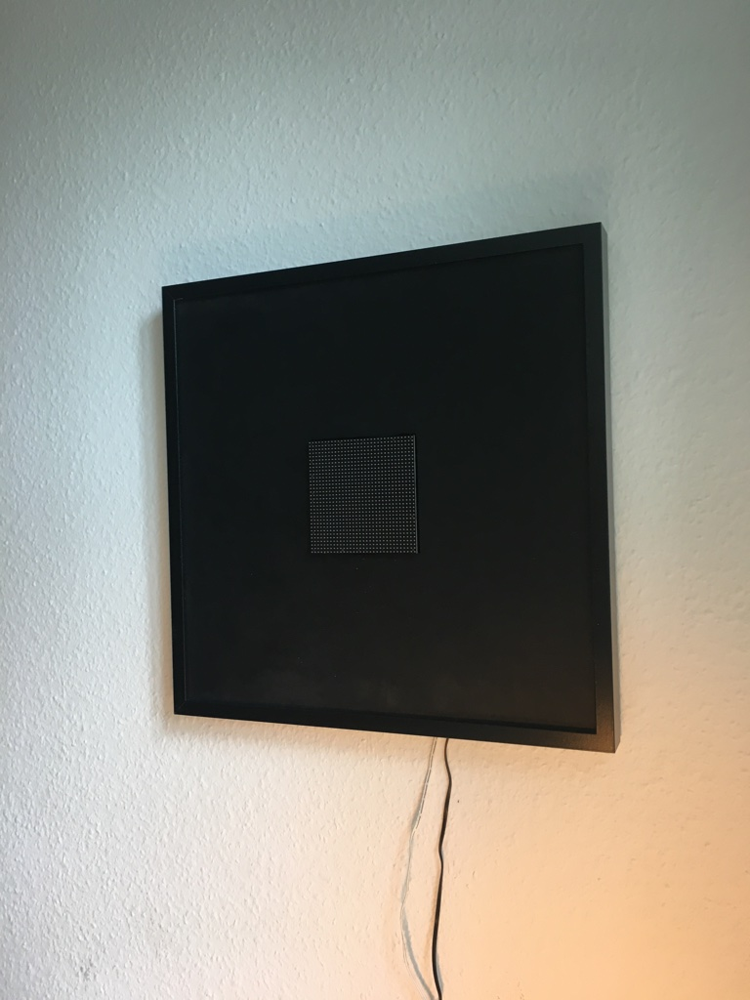

This project aims to represent this risk through an interactive LED board, allowing the user to change the level of vaccinated subjects in the sample and watch as a disease spreads throughout the population. Visual representation of this concept can show the user how effective vaccines have been on diseases of the past and can be for the unknown diseases of the future. And at the same time show the devastating effects if there is a breakdown of this epidemic management system known as herd immunity.

The software was written in Python using a K Nearest neighbour algorithm to replicate the spread. A link to my GitHub can be found at the bottom of this blog post. The hardware used consisted of a headless [Raspberry Pi Zero](https://thepihut.com/collections/raspberry-pi/products/raspberry-pi-zero-wh-with-pre-soldered-header) along with the [Adafruit 32X32](https://thepihut.com/products/32x32-rgb-led-matrix-panel-6mm-pitch) LED board. To connect the LED board to the Pi zero, an [Adafruit RGB Matrix Bonnet](https://thepihut.com/products/adafruit-rgb-matrix-bonnet-for-raspberry-pi-ada3211) was used. This allowed the pi to be connected to the LED matrix, while also powering the matrix at the same time. This came with a library for interacting with the board which could be installed on the pi zero. It can be found [here](https://github.com/hzeller/rpi-rgb-led-matrix).

The display frame is simply a picture frame. The LED board is held in place in a cut-out section of black painted wood. Behind the wood, the pi zero was mounted with velcro to keep it in place. The back of the frame can then be closed to create a self-contained unit.

The following image reels show how the LED board operates to visualise the spread. I decided to go with splits of 40% immune, 55% immune, and 70% immune because I feel the results and speed of the spread best showed the effectiveness of having strong herd immunity.

### 40% Immune

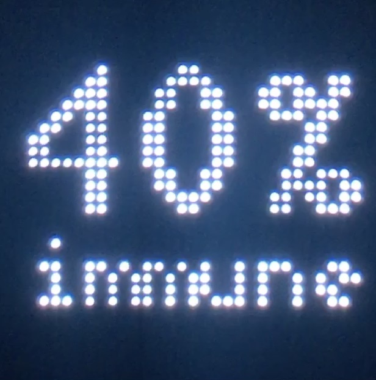
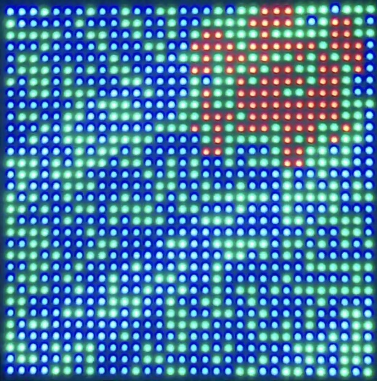
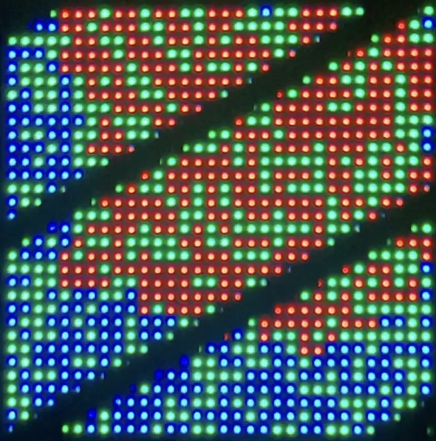
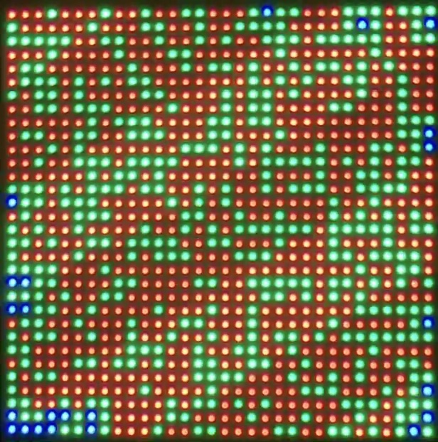
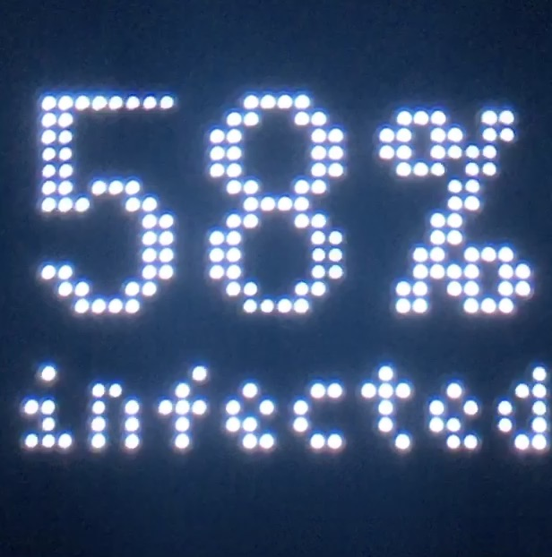

As we can see above, having 40% immune provides little to no barrier to the spread of infection.

### 55% Immune

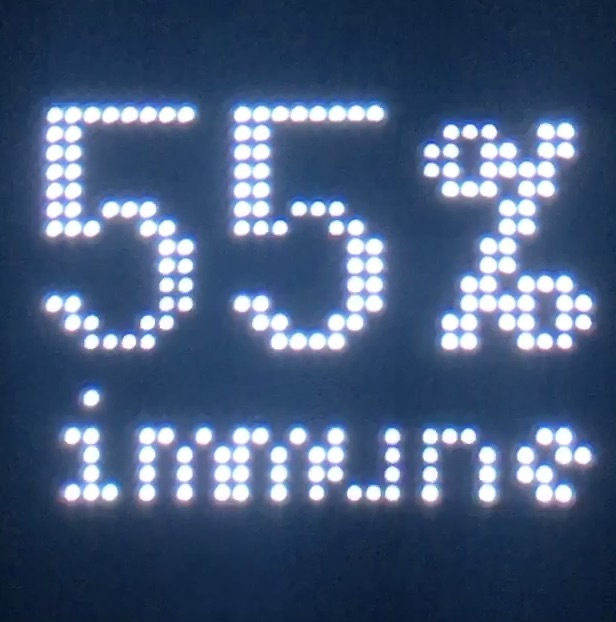
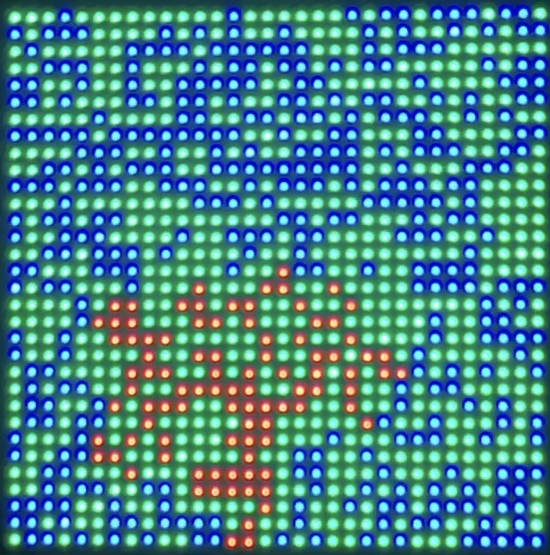
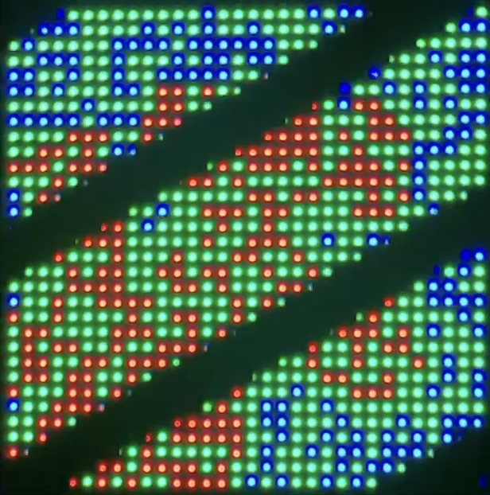
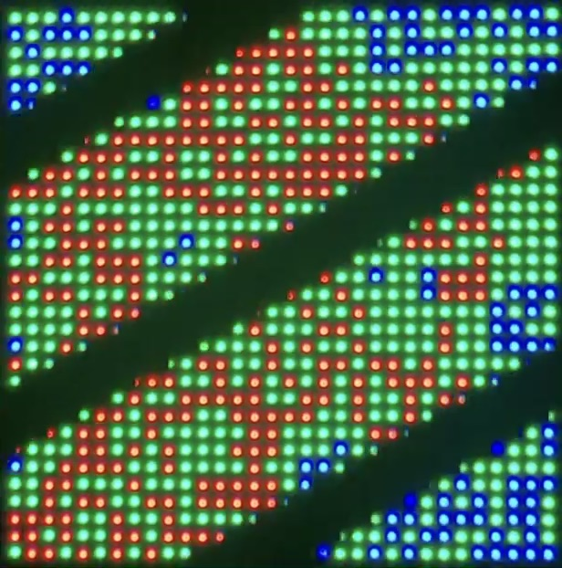
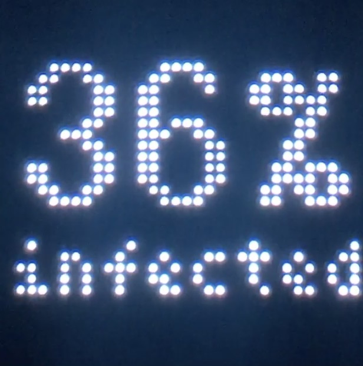

55% immune fairs a bit better, but still doesn't provide good enough protection to prevent clusters from spreading out of control.

### 70% Immune

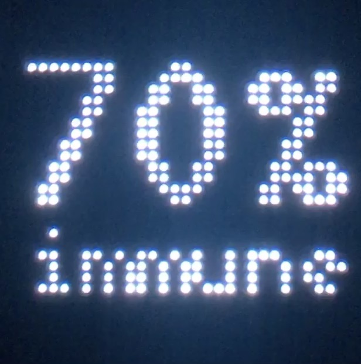
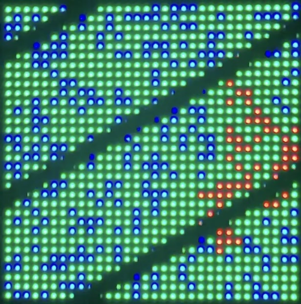
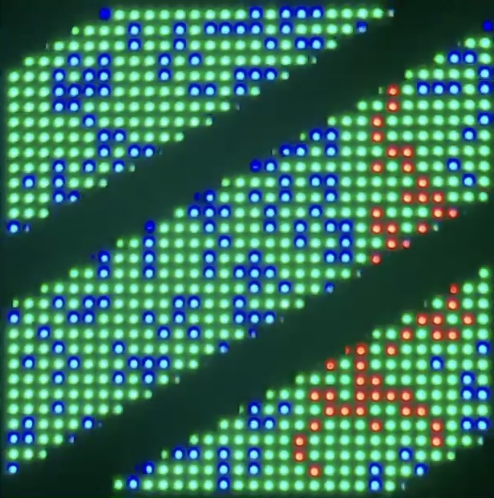

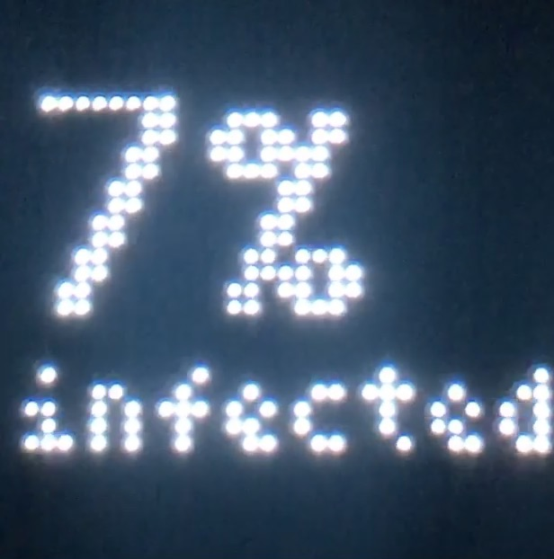

At 70% we can start to see the benefits take effect, a cluster has been stopped in its tracks preventing it from reaching other parts of the population sample.

**Note:** Why can't I watch a video of it in action? The LEDs are rapidly switching on and off as they refresh themselves, this isn't visible to the human eye. Unfortunately, it's visible to a camera. Any video taken has a very strong flicker making it unpleasant to watch. This could be resolved by changing the shutter speed of my camera, but this isn't possible with my phone. So a Timeline of photos was the next best thing.

## Conclusion

The aim of this project was to show the concept of herd immunity using a simple design concept. With a plug-and-play design, the display could be placed anywhere to allow people to quickly understand the concept of herd immunity.

If you'd like to chat more feel free to contact me [here](mailto:chat@aaronregan.eu) or head on over to the GitHub [repo](https://github.com/AaronRegan/herd-matrix).
